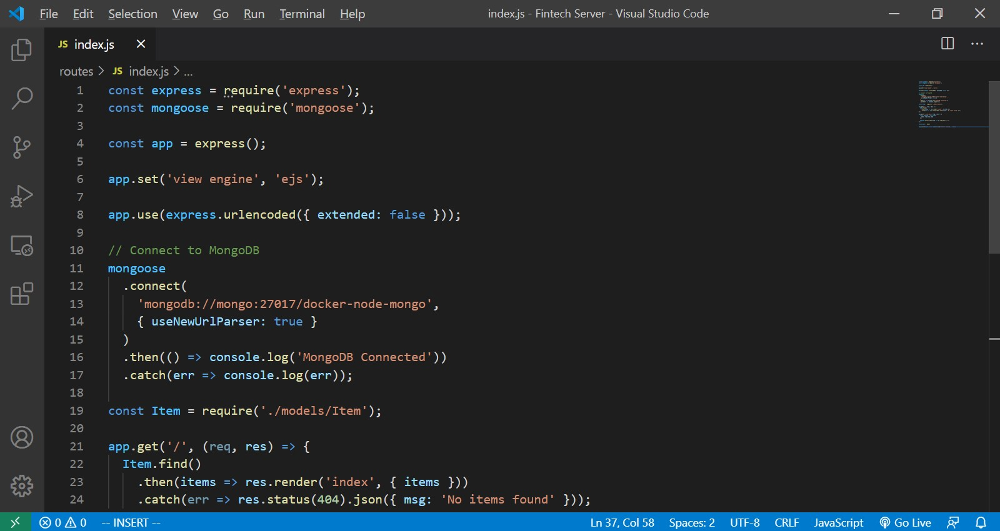
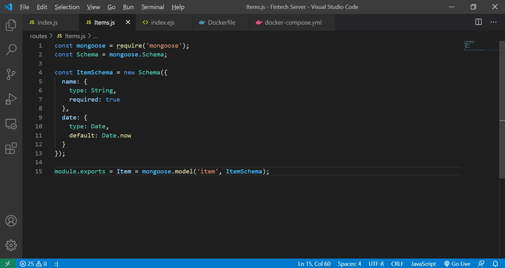

## Docker Compose to run 2 (or more) containers: Express.js and MongoDB

---

A docker-compose yml file is required to run 2 containers.
To link the Express container with the MongoDB container
using the keyword: `link`

An index.js file contains the CRUD APIs to retrieve the data from
the MongoDB

---
### Establish connection to Mongo and write APIs 
`index.js`

### Design the database schema
`Items.js`

### Create a simple HTML view
`index.ejs`

### Create a Dockerfile
`Dockerfile`

### Create a docker-compose.yml file
`docker-compose.yml`

Steps to run:

### 1: Get Source

`git clone https://github.com/franktanah/docker-api-mongoDB`

### 2: Change directory

`cd docker-api-mongoDB`

### 3: Run Docker Compose

`docker-compose up`

### 4: Add data to the database 

`website address: localhost:80`

There is a frontend interface with a textbox and a "Add" button
to add items to the database - if everything runs successfully

